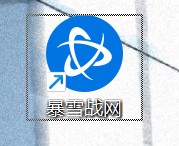
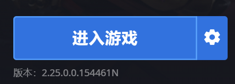
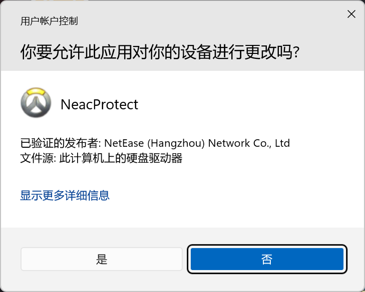

# Overwatch CN Quick Launch · 守望先锋一键启动

> 针对国服一键打开守望先锋的懒人应用。

## 1. 懒人专用

纯懒人来的，我就是想省了需要打开暴雪客户端然后再自己点开始游戏那个步骤（可能有的电脑还需要点一下 UAC 弹窗确定，默认设置的情况下都会弹吧？），**将两个或三个步骤压缩到了一个**。点了后你就可以不用守着电脑等界面出现一个一个自己点了，这个时候呢，你可以去接个水呀，上个厕所什么的。

## 2. 如何使用

把唯一一个 exe 文件**放在暴雪客户端目录下**就是了啦，然后双击，操作很简单，就算点错了也会有指引的哦~

## 3. 关于 UAC 弹窗（Windows 安全）

不用担心，这是软件运行的必要环节，只在首次使用，没有干坏事哦，详情看工作原理。

## 4. 电脑特别卡怎么办

如果你的**电脑特别卡**的话，开客户端和游戏需要几分钟的话，这款软件最适合你了，不过你需要一些额外的文件**一同放入客户端根目录**，一同下载 release 中的 **config.ini**，**用文本打开**，对其中的**数字的值调大**就行了。

## 5. 如何卸载

真不明白居然还有要卸载这个东西的嘛？很简单啦，把 release 里的 ***Uninstall.bat 也放入客户端根目录管理员运行*** 就可以啦，最后手动给这个文件删除就好了喵。

## 6. 工作原理

其实很简单来的，在你电脑的计划任务里面创建了个***对暴雪客户端发起打开 OW 的指令***，然后创建这个任务是需要管理员权限的喵，所以第一次会需要 UAC，后续只是调用就不需要了喵，由计划任务打开的守望先锋不会弹出 UAC 弹窗。运行软件后，检测到暴雪客户端窗口就轮询发送打开游戏指令，检测到游戏打开后就自动退出程序，没了喵。

---

> 此应用由 AI 创作。
